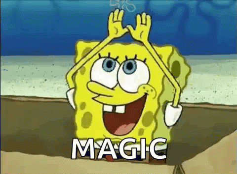

	  

<h1>Classificação de Texto com aprendizadgem supervisionada</h1>

Projeto de extração, análise e previsões em fóruns da internet.

## O que este projeto faz

São extraídas em tempo real postagens dos seguintes temas:

- Ciência de Dados
- Aprendizado de Máquina
- Física
- Astrologia
- Conspirações

As postagens são separadas em conjuntos de treino, isto é, mostramos para nosso algoritmo como classificar cada um dos conteúdos.

Após o treino, deixamos que nosso algoritmo analise os dados restantes, até então desconhecidos. O objetivo do modelo é descobrir sobre qual tema é o texto da postagem. Foram utilizados 3 algoritmos de aprendizado de máquina, e a acurácia do melhor modelo foir de 86%.

Ou seja:

Se mostrarmos qualquer post da rede social, o algoritmo é capaz de reconhecer o assunto dos textos cerca de 86% das vezes, mesmo sem nunca ter "lido" o conteúdo.

## Definição do projeto

Com base em posts do reddit, será usado um algoritmo para prever o assunto destes posts.

- Para evitar o bloquio da conta, será utilizada a [API](https://www.reddit.com/wiki/api) disponibilizada pelo reddit.
- Para a libereação da API, deve-se cadastrar a conta de desenvolvedor [aqui](https://www.reddit.com/prefs/apps).

## Ambiente de desenvolvimento

- [ ] Anaconda
- [ ] VSCode
- [ ] `pip install config`
- [ ] `pip install praw`

