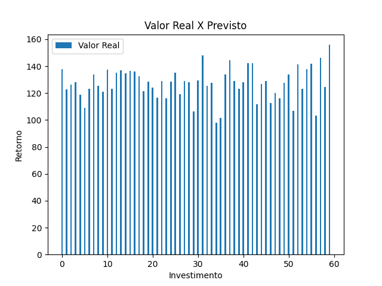
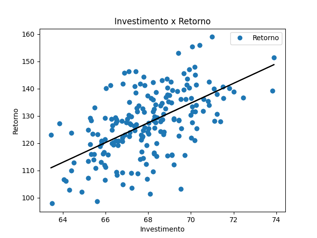
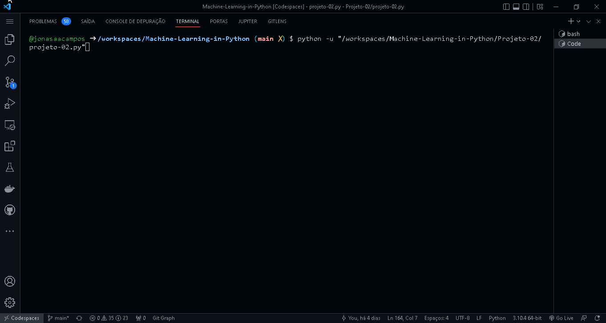

<p align="center">
	  <a href='https://jonasaacampos.github.io/portfolio/'>
      
      </a>
</p>


<h1>Criação de modelo de aprendizado de máquina que prevê o retorno financeiro de investimentos em títulos públicos</h1>


Construção de modelos de machine learning para prever o retorno de um investimento

[](https://jonasaacampos.github.io/portfolio/)
[](https://www.linkedin.com/in/jonasaacampos)

## Table of Contents
- [Table of Contents](#table-of-contents)
- [Definição do projeto](#definição-do-projeto)
- [Regressão Linear](#regressão-linear)
- [To do](#to-do)
- [Demo](#demo)
- [Para saber mais](#para-saber-mais)
- [Crédito das imagens](#crédito-das-imagens)
- [Contato](#contato)

## Definição do projeto

Dado o valor de um investimento, qual o retorno possível?

$$ Taxa De Retorno={Valor Atual - Valor Original\over{ValorOriginal}} * 100 $$

Este é um exemplo de que NÃO PRECISAMOS de machine learning. Se eu tenho os dados e a fórmula matemática, basta usá-los.

Se eu não souber a fórmula matemática que determina a relação entre os dados, então o aprendizado de máquina É IDEAL, pois ela descobrirá de forma aproximada qual função matemática melhor de aplica para o mesmo resultado de uma fórmula matemática conhecida.

## Regressão Linear

> A análise de regressão linear é usada para prever o valor de uma variável com base no valor de outra. A variável que deseja prever é chamada de variável dependente. A variável que é usada para prever o valor de outra variável é chamada de variável independente. (IBM, 2022)

$$ Y = b0 + b1 * x $$

```
Y = variável dependente
X = variável independente
b0 = intercept
b1 = coeficiente

b0 e b1 são estimados durante o treinamento com dados históricos
```
- Variáveis independentes são aquelas que são manipuladas
- variáveis dependentes são apenas medidas ou registradas

## To do
- [x] Fazer funções para organizar código
- [x] Conferir valores escores de previsão
- [ ] Refatorar código criando classes e métodos para modularização e reaproveitamento do código em outros projetos

**Construção dos modelos**
- [x] 01 modelo utilizando framework
- [ ] 01 modelo construído do zero
  - Faz sentido somente se a regra de negócio requerer ou se dor estritamente necessário

## Demo

<table>
<thead>
  <tr>
    <th></th>
    <th></th>
  </tr>
</thead>
<tbody>
  <tr>
    <td></td>
    <td></td>
  </tr>
</tbody>
</table>




## Para saber mais

- IBM, 2022. [Regressão linear - Gere previsões usando uma fórmula matemática facilmente interpretada.](https://www.ibm.com/br-pt/analytics/learn/linear-regression)
- DataScience, 2000. [Uma Atualização na Análise de Regressão](https://datascience.eu/pt/matematica-e-estatistica/uma-atualizacao-na-analise-de-regressao/)
- [Métodos e fórmulas para coeficientes em Ajustar modelo de regressão](https://support.minitab.com/pt-br/minitab/18/help-and-how-to/modeling-statistics/regression/how-to/fit-regression-model/methods-and-formulas/coefficients/#:~:text=Coeficiente%20%28Coef.%29%20A%20f%C3%B3rmula%20para%20o%20coeficiente%20ou,regress%C3%A3o%20m%C3%BAltipla%20%C3%A9%3A%20b%20%3D%20%28%20X%27X%29%20-1X%27y.)

## Crédito das imagens

- Desenhos no título by [flaticon](https://www.flaticon.com)
- Badges e demos do projeto feitos por mim

<!-- CONTACT -->
## Contato

**Author:** Jonas Araujo de Avila Campos

**Confira mais projetos: [AQUI](https://jonasaacampos.github.io/portfolio/)**

<p align='center'>
  <a href='https://github.com/jonasaacampos'>
    
  </a>
  <a href='https://www.linkedin.com/in/jonasaacampos/'>
    
  </a>
</p>
